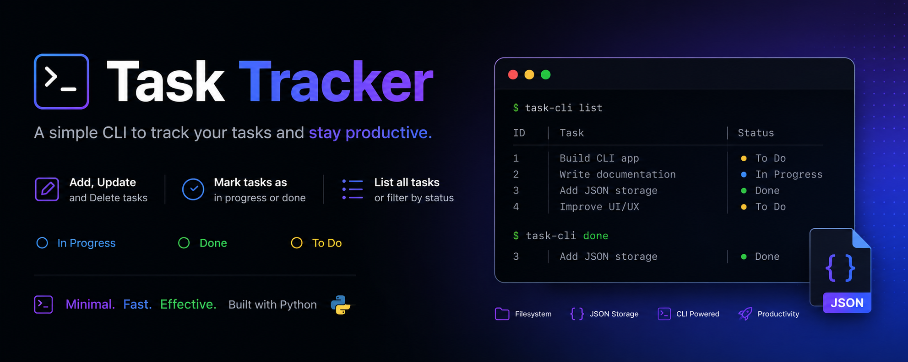
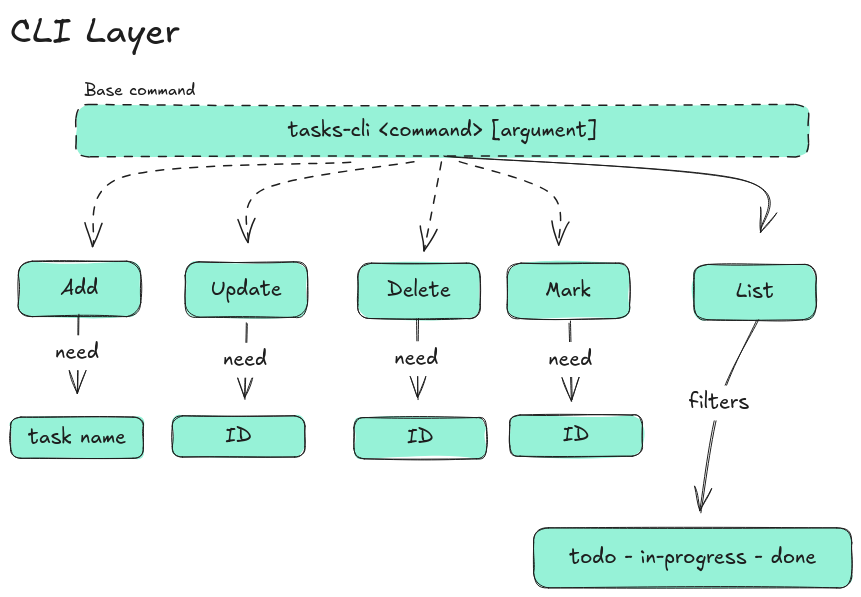

# 📦 Task Tracker CLI



A simple CLI task tracker application where users can (add, update, delete and list tasks). Tasks are stored locally as JSON files.

## ✨ Features

Currently the app have the following features:

- Add, Update, and Delete tasks
- Mark a task as in progress or done
- List all tasks
  - List all tasks that are done
  - List all tasks that are not done
  - List all tasks that are in progress

---

## 🛠️ Technologies

The application is build with:

- Pure Python with no libraries or frameworks
- `argparse` module
- JSON

---

## 📥 Installation

To run the app locally:

```bash
git clone git@github.com:mohamedy72/task_tracker_cli.git
cd task_tracker_cli
uv sync
```

## 🚀 Usage

Here is how to use the app

```bash
# Adding a new task
tasks-cli add "Buy groceries"


# Updating and deleting tasks
tasks-cli update 1 "Buy groceries and cook dinner"
tasks-cli delete 1

# Marking a task as in progress or done
tasks-cli mark-in-progress 1
tasks-cli mark-done 1

# Listing all tasks
tasks-cli list

# Listing tasks by status
tasks-cli list done
tasks-cli list todo
tasks-cli list in-progress
```

## 📁 App Diagram



## 📖 What I Learned

This project taugh me the following:

- How to work with python's standard libraries (`pathlib`, `json`, `argparse` .. etc)
- How to layout the app into layers
- Applied separation of concern

## 📜 License

This project is licensed under the **MIT License**
